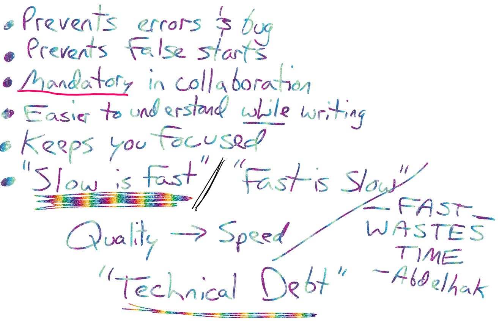

# Calculating the Area of a Trapezoid
## Demo with Pseudocode

#### RESEARCH VIDEO: [How to calculate the area of a trapezoid?](https://www.khanacademy.org/math/basic-geo/basic-geo-area-and-perimeter/area-trap-composite/v/area-of-a-trapezoid-1)

## Why do we like pseudocode?

